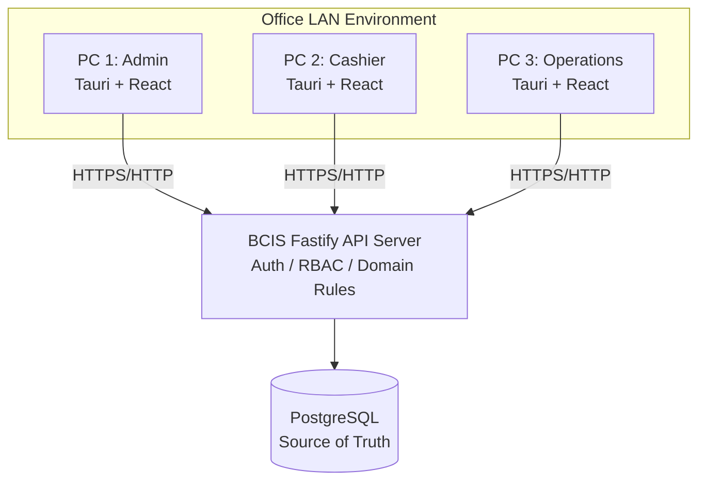

# BCIS Subscription Billing and Collection System


A professional-grade Subscription Billing and Collection System designed for **Bukidnon Cable and Internet Services (BCIS)**. This application is architected as a Windows desktop client for a small office LAN environment, delivering financially correct billing, payment collection, and operational management with strict role-based access.

## 🚀 Project Overview

The system is designed to handle core ISP operational workflows rather than a simple CRUD application. It establishes immutable historical financial records, precise GCash verification, and reliable concurrent operation for a multi-terminal setup (Owner/Admin, Cashier, Operations). 

**Primary Goals:**
- Financially accurate billing and payment workflows
- Immutable historical records with controlled adjustments
- Fast and robust cashiering and subscriber search
- Audit-ready operations with PDF/XLSX reporting
- Secure backend-enforced authorization

## 🏗️ System Architecture

This project is not a traditional monorepo; it is a **Centralized Workspace Orchestrating Two Separate Git Repositories**. The Tauri frontend communicates exclusively with the Fastify backend via a versioned REST API. The frontend *never* connects directly to PostgreSQL.



## 💻 Technology Stack

### 🖥️ Desktop Frontend (`frontend/`)
- **Shell:** Tauri 2.x (Rust)
- **Framework:** React 19.2 (Vite) & TypeScript Strict
- **Styling & UI:** Tailwind CSS 4, shadcn/ui, TanStack Table
- **State Management:** TanStack Query, React Hook Form
- **Testing:** Vitest, React Testing Library

### ⚙️ Backend API (`backend/`)
- **Runtime:** Node.js LTS with Fastify 5
- **Language:** TypeScript Strict
- **Validation:** Zod 4
- **Database & ORM:** PostgreSQL & Drizzle ORM
- **Testing:** Vitest, Playwright (E2E)
- **Documentation:** OpenAPI

## 📁 Repository Structure

The root directory acts purely as a **developer control plane**. Dependencies and configurations are strictly separated between `backend/` and `frontend/`. 

```text
BCIS-Subscription-Billing-System/
├── backend/                  # Independent API repository
├── frontend/                 # Independent Desktop App repository
├── scripts/                  # Cross-repository automation (PowerShell)
├── package.json              # Root orchestration scripts
├── PRODUCT.md                # System requirements & constraints
├── DESIGN.md                 # UI/UX design specifications
└── SKILLS.md                 # Agent behavior & tooling rules
```

## 🚀 Getting Started

### Prerequisites
- **Node.js** (LTS) & **pnpm**
- **Rust Toolchain** (for Tauri Windows builds)
- **PostgreSQL** server running
- **WebView2** runtime (Windows)

### Installation
Do not install dependencies inside individual folders manually. Run the orchestration script from the project root:

```bash
# Install dependencies for both backend and frontend
pnpm install:all
```

### Development
Use the root aliases to launch the development servers.

```bash
# Start both environments in parallel (if supported) or separate terminals:
pnpm backend:dev
pnpm frontend:dev
```

## 🧪 Testing & Validation

All tests are driven from the root workspace, delegating to the respective environment.

```bash
# Run unit and integration tests across the suite
pnpm test

# Typechecking and linting
pnpm typecheck
pnpm lint
```

*Note: Frontend Pull Requests are gated against OpenAPI contract validations and end-to-end (E2E) test passes.*

## 🎨 Design System ("Operational Trust")

The application strictly adheres to the **Operational Trust** aesthetic profile, tailored for enterprise data density and clarity.
- **Colors:** Deep Navies (`#0F2747`), Accessible Blues (`#2563EB`), with semantic Warning/Danger highlights.
- **Typography:** `Inter` for standard reading; `tabular-nums` monospace for all financial figures.
- **Components:** Explicitly defined interactive states (Default, Hover, Active, Focus, Loading, Empty) with rigorous accessibility compliance.

## 📖 Key Documentation

- [**PRODUCT.md**](./PRODUCT.md) — Comprehensive product requirements, architecture rules, and non-negotiable business rules. Read this before making logic changes.
- [**DESIGN.md**](./DESIGN.md) — Exact styling rules, spacing, typography scales, and UI interaction standards.
- [**SKILLS.md**](./SKILLS.md) — AI agent configuration rules, required behavior, and skill sets for development.

## ⚖️ Constraints & Principles
- **Immutable Ledgers:** Posted records are never silently altered. Corrections enforce explicit reversal/adjustment workflows.
- **No Shared Code:** The API schema acts as the strict contract between frontend and backend.
- **Security:** No raw SQL in the UI; authorization and sensitive data validation are exclusively handled on the server.
